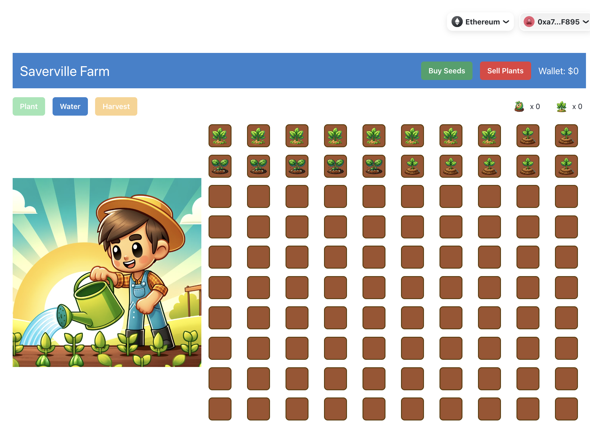

# Saverville App


## Welcome to Saverville Farm!

Saverville is a decentralized farming simulation game built on blockchain technology. It offers a unique blend of farming fun and financial strategy, allowing players to manage virtual farms and grow crops that represent financial investments. Here's what you need to know to get started in Saverville:

### What is Saverville?

Saverville Farm is more than just a game—it's an innovative way to engage with blockchain technology and decentralized finance (DeFi). In Saverville, you play as a farmer who cultivates crops on your virtual farm. These crops symbolize financial investments, growing over time and yielding returns once harvested. The game mechanics are designed to mimic the principles of certificates of deposit (CDs), where your investment matures and gains interest over a period.

### Game Mechanics

#### Purchasing Seeds
Start by buying seeds from the Market. Each seed represents a small investment in your farm.

#### Planting Seeds
Plant your seeds in one of the available plots on your farm. Each plot can hold one seed at a time.

#### Growth Period
Your seeds will grow over time. The growth period includes a random variance, making each planting unique. Water your plants to ensure they grow to their full potential.

#### Harvesting
Once your plants have matured, you can harvest them. Harvesting represents the maturity of your investment, providing you with returns in the form of ETH.

#### Selling Crops
Sell your harvested crops back at the Market to realize your profits. This step converts your matured investments back into liquid assets.

#### Withdrawing Funds
Withdraw your funds at any time, similar to how you would with a savings account. Your earnings from harvested crops are yours to keep and use as you see fit.

### How to Get Started

1. **Connect Your Wallet**: Ensure you have a compatible Ethereum wallet connected.
2. **Buy Seeds**: Use the "Buy Seeds" button to purchase seeds from the Market.
3. **Plant Seeds**: Click on an empty plot and select "Plant" to plant your seeds.
4. **Water Plants**: Monitor your farm and water your plants as needed to promote growth.
5. **Harvest Crops**: Once your plants are ready, click on them and select "Harvest" to collect your earnings.
6. **Sell Plants**: Use the "Sell Plants" button to sell your harvested crops back to the Market.
7. **Manage Your Wallet**: Keep track of your wallet balance and withdraw funds whenever you wish.

### Why Saverville?

Saverville combines the joy of farming simulation games with the real-world benefits of decentralized finance. It's an engaging way to learn about and interact with blockchain technology, all while having fun and potentially earning real ETH.

### Features

- **Interactive Farming Experience**: Manage up to 100 plots on your virtual farm.
- **Blockchain Integration**: Enjoy the security and transparency of blockchain technology.
- **Random Growth Periods**: Each seed's growth period is unique, adding an element of unpredictability.
- **Financial Returns**: Harvested crops yield financial returns, making your in-game efforts rewarding in the real world.
- **User-Friendly Interface**: Intuitive and colorful design to enhance your farming experience.


---

This project was made using the Web3 Starter Template by iMuzz. The original README can be found below.

---

# Web3 Starter

Web 3 Starter is a modern web 3 starter template project.

Here's the full stack of frameworks/libraries used:

- Next.js React
- TailwindCSS for styling
- [HeadlessUI](https://headlessui.dev/) for Tailwind components
- [@rainbow-me/rainbowkit](https://github.com/rainbow-me/rainbowkit) to connect to ethereum wallets
- [react-hot-toast](https://react-hot-toast.com/) for toast messages
- [unstated-next](https://github.com/jamiebuilds/unstated-next) for state management
- [next-themes](https://www.npmjs.com/package/next-themes) for dark mode theme

## How to Setup Development Environment

#### A. Start the local hardhat ethereum node

```bash
npx hardhat node
```

#### B. In a seperate shell, start the NextJS Server.

```bash
yarn && yarn dev
```

Navigate to `http://localhost:3000` to see your app.

## First Time Project Template Setup

#### 1. Create a `.env` file.

```bash
# Private key used for testnets (ropsten)
ETH_PRIVATE_KEY=""

# This is the private key you will used to deploy to mainnet
ETH_MAINNET_PRIVATE_KEY=""

# This API Key is used for Etherscan contract verifications
# To obtain the API Key go here -> https://etherscan.io/apis
ETHERSCAN_API_KEY=""

# This is the address of the contract that will be used in production
# You'll neeed to set it here, and in Vercel (or wherever you choose
# to deploy the app.)
NEXT_PUBLIC_CONTRACT_ADDRESS=""

# Name of the network contract is deployed on
NEXT_PUBLIC_NETWORK_NAME=""

# This API is needed when you run `npx hardhat test` -- so that
# you can approximate the cost of deployin your contract on mainnet
COIN_MARKETCAP_API_KEY=""
```

## Resources

#### Frontend

- **[Tailwind UI](https://tailwindcss.com/docs)**
- **[Tailwind UI Components](https://tailwindui.com/)**
- **[Tailwind Community Components](https://tailwindcomponents.com/)**
